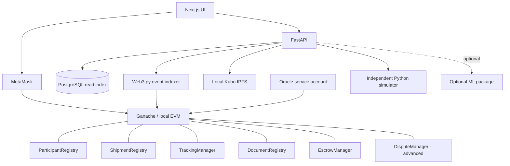

# ARCHITECTURE

## 1. Architectural principles

1. Smart contracts are authoritative for on-chain shipment state and event history.
2. PostgreSQL is a rebuildable query index, not an independent source of truth.
3. Human users sign writes through MetaMask. Backend writes are limited to the explicitly authorized Oracle service account for oracle functions.
4. Large documents stay off-chain; only their SHA-256 hash and CID are anchored.
5. Consensus simulation is an independent educational package and does not alter Ganache consensus.
6. Contracts have narrow responsibilities and explicit trust boundaries.

## 2. Logical architecture

## 3. Services and local ports

| Service | Technology | Default port |
|---|---|---:|
| Frontend | Next.js | 3000 |
| API | FastAPI / uvicorn | 8000 |
| Ganache RPC | Local EVM | 8545 |
| PostgreSQL | Docker | 5432 |
| IPFS API / gateway | Kubo | 5001 / 8080 |
| Oracle service | Python | 8100 |

## 4. Smart contracts

All contracts use Solidity `0.8.24`, custom errors, role checks through `ParticipantRegistry`, and events for state changes.

| Contract | Responsibility | Canonical operations |
|---|---|---|
| `ParticipantRegistry` | Role and active status | `registerParticipant`, `revokeParticipant`, `roleOf`, `isActive` |
| `ShipmentRegistry` | Shipment fields and sole status owner | `createShipment`, `acceptShipment`, `rejectShipment`, `cancelShipment`, `confirmDelivery`, `acceptDelivery`, `getShipment` |
| `TrackingManager` | Milestones, custody and oracle reports | `startTransit`, `recordMilestone`, `confirmWarehouseArrival`, `transferCustody`, `submitOracleUpdate`, `markDelayed` |
| `DocumentRegistry` | Hash/CID anchoring and clearance | `registerDocument`, `verifyDocument`, `recordClearance`, `isHashRegistered`, `getDocuments` |
| `EscrowManager` | Test-ETH escrow | `deposit`, `markEligible`, `releasePayment`, `refund`, `freeze`, `setRules` |
| `DisputeManager` | Advanced dispute workflow | `raiseDispute`, `resolveDispute`, `getDispute` |

`ShipmentRegistry` is the sole owner of shipment status. Other contracts may request transitions only through narrowly scoped `onlyManager` entry points exposed for the intended contract addresses. Those entry points must validate caller contract, shipment existence and transition legality. Do not expose a generic unrestricted status setter.

`ShipmentInput` contains: `externalRef bytes32`, `productDescription string`, `quantity uint32`, `origin string`, `destination string`, `destLat int32`, `destLon int32`, `geofenceRadiusM uint32`, `transporter address`, `receiver address`, optional `warehouse address`, optional `inspector address`, `expectedDelivery uint64`, and `paymentAmount uint256`.

Canonical enums:
- `Role`: `None, Admin, Shipper, Transporter, Warehouse, Inspector, Receiver, Oracle`
- `Status`: `Created, Accepted, InTransit, Delayed, Arrived, Delivered, Completed, Rejected, Disputed, Cancelled`
- `MilestoneType`: `Dispatched, InTransit, WarehouseArrival, Arrived, Delivered`
- `DocType`: `Invoice, BillOfLading, PackingList, InspectionCertificate, Other`
- `Condition`: `Intact, Damaged, Partial`
- `DisputeReason`: `Damaged, Missing, Delayed, Other`
- `Resolution`: `ReleaseToTransporter, RefundToShipper, Split`

## 5. Shipment transition matrix

| From | To | Actor / authority | Guard |
|---|---|---|---|
| None | Created | Shipper | Unique reference; active assigned parties |
| Created | Accepted | Assigned Transporter | Shipment not terminal |
| Created | Rejected | Assigned Transporter | Escrow refund path, if funded |
| Created | Cancelled | Shipper | Cancellation allowed by terms; refund if funded |
| Accepted | InTransit | Transporter | Escrow funded when configured as required |
| InTransit | Delayed | Transporter / Oracle / Admin | Expected time passed or authorized delay report |
| Delayed | InTransit | Transporter | Shipment resumes |
| InTransit / Delayed | Arrived | Transporter / Warehouse / Oracle | Arrival guard; geofence only for oracle route |
| Arrived | Delivered | Receiver | Condition recorded |
| Delivered | Completed | Receiver | Receiver accepts delivery; escrow may become eligible |
| InTransit / Delayed / Arrived / Delivered | Disputed | Shipper / Receiver | Valid dispute; escrow frozen if funded |
| Disputed | Completed / Cancelled | Admin | Valid resolution and payout path |
| Any other pair | — | — | Revert with a transition error |

Dispute and penalty logic is advanced scope. The exact precedence between delivery acceptance, dispute opening and payment release must be tested; a completed or paid shipment must not be reopened.

## 6. Events

Canonical event families include `ParticipantRegistered`, `ParticipantRevoked`, `ShipmentCreated`, `ShipmentAccepted`, `ShipmentRejected`, `ShipmentCancelled`, `StatusChanged`, `CustodyTransferred`, `MilestoneRecorded`, `OracleUpdateRecorded`, `DocumentRegistered`, `DocumentVerified`, `ClearanceRecorded`, `EscrowFunded`, `PaymentEligible`, `PaymentReleased`, `PenaltyApplied`, `EscrowRefunded`, `DisputeRaised`, `DisputeResolved` and `RuleChanged`.

Each external state-changing operation must emit an event that allows the indexer to reconstruct the relevant state. Avoid sensitive document contents and personal information in event arguments.

## 7. Escrow rules

Escrow holds Ganache test ETH only. `deposit(id)` accepts exactly the configured `paymentAmount`. On accepted delivery, the shipment can become `Completed` and payment eligible. `releasePayment(id)` is a pull-style, once-only operation. Advanced late penalty defaults: `latePenaltyBpsPerDay = 200`, `maxPenaltyBps = 3000`, and `requireEscrowBeforeDispatch = true`. Penalty is capped and calculated in integer arithmetic with explicit rounding. Effects precede external transfers and all ETH transfer paths are reentrancy-protected. Rejection/cancellation refund rules must be idempotent and tested.

## 8. Document flow

1. Authorized participant uploads bytes to API.
2. API validates size/type policy, computes SHA-256 and adds bytes to IPFS.
3. API returns CID and hash; this step does not write to chain.
4. User verifies metadata and signs `registerDocument` in MetaMask.
5. A later verification recomputes SHA-256 from supplied bytes and compares it to the anchored hash.
6. IPFS availability and confidentiality are not implied by a successful hash comparison.

## 9. Event indexer

Poll logs from the deployment block in bounded block ranges. Store raw events uniquely by `(tx_hash, log_index)` and update derived tables in a transaction. Persist the last fully processed block only after successful processing. Handle duplicate polling idempotently. For local Ganache resets, detect chain/deployment mismatch and require reindex/reset procedure. Reindex must clear only chain-derived tables, replay logs from the configured deployment block and preserve off-chain-only profile/auth/simulation data.

## 10. Consensus simulator

Independent Python package interface: `run(config, seed) -> RunResult`. Initial required educational models: PoW, PoA and PBFT-lite. PoS and PoET must be explained accurately in course documentation; their simulator implementation is optional and must not delay MVP.

| Model | Educational abstraction | Metrics |
|---|---|---|
| PoW | SHA-256 nonce search and longest-chain selection | hash attempts, simulated latency, throughput |
| PoA | Fixed authority set and deterministic proposer rotation | messages, latency, fault behavior |
| PBFT-lite | Pre-prepare, prepare and commit phases; `n >= 3f+1` assumption | messages, commit latency, tolerated faults |
| PoS / PoET | Documented conceptual comparison; optional prototype | Only report metrics if implemented and tested |

Use identical workload, configuration assumptions and seed for comparisons. State that the model is simplified, does not model all network/economic effects, and is not Ganache's consensus implementation.

## 11. Trust boundaries

| Boundary | Trust assumption / control |
|---|---|
| Browser and wallet | User-controlled; validate chain, address and transaction state |
| Backend | Trusted application service but not authoritative for chain state |
| Smart contracts | Enforce coded rules; correctness depends on code and deployment |
| PostgreSQL | Derived read model; rebuild from events |
| IPFS | Content-addressed; availability and confidentiality are separate concerns |
| Oracle | Trusted reporter, not a truth oracle; restrict signer and label provenance |
| Admin | Trusted registrar/arbitrator; actions must be auditable |

## 12. Deployment

Local workflow: start PostgreSQL/IPFS with Docker Compose; start Ganache or approved Hardhat node; deploy contracts; write addresses and deployment block to `deployments/local.json`; run Alembic migrations and deterministic seed; start API, optional Oracle and frontend. Contracts are non-upgradeable in the MVP. An upgrade means reviewed redeployment and data migration; proxy architecture is future work, not an assumed feature.
