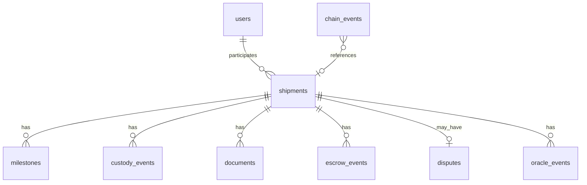

# DATABASE

PostgreSQL 16, SQLAlchemy 2 and Alembic. Chain-derived records are a rebuildable read model. Off-chain-only data must be clearly separated.

## 1. Rules

- Use `snake_case`; timestamps are UTC `timestamptz`.
- Normalize EVM addresses to lowercase `varchar(42)`.
- Store wei as `numeric(78,0)` and hashes as `varchar(66)`.
- Chain-derived records carry `block_number`, `tx_hash`, and `log_index`; uniqueness is `(tx_hash, log_index)` where one row represents one log.
- Never accept API-provided role/status as authority when the chain provides it.
- `POST /admin/reindex` rebuilds chain-derived tables only.

## 2. Entity overview

## 3. Tables

| Table | Purpose | Source |
|---|---|---|
| `users` | Wallet address, display/org profile and cached role state | Mixed; profile off-chain, role mirrored from chain |
| `auth_nonces` | Single-use login nonce and expiry | Off-chain |
| `shipments` | Current shipment projection | Chain-derived |
| `milestones` | Ordered tracking milestones and provenance | Chain-derived |
| `custody_events` | Custody transfer history | Chain-derived |
| `documents` | Anchored document metadata, hash, CID and verification | Chain-derived except filename hint |
| `escrow_events` | Escrow lifecycle event projection | Chain-derived |
| `disputes` | Dispute state and resolution | Chain-derived |
| `oracle_events` | Oracle location/status reports | Chain-derived |
| `oracle_scenarios` | Local scenario controls | Off-chain |
| `chain_events` | Raw decoded event audit log | Chain-derived |
| `indexer_state` | Last fully processed block/deployment identity | Off-chain indexer control |
| `sim_runs` | Simulator configuration, seed, metrics and block trace | Off-chain |
| `delay_predictions` | Optional model outputs and feature snapshot | Off-chain |

## 4. Key columns and constraints

- `users`: `id`, `wallet_address UNIQUE`, `role`, `display_name`, `org_name`, `is_active`, `registered_block`, `created_at`.
- `auth_nonces`: `id`, `wallet_address`, `nonce UNIQUE`, `expires_at`, `used_at`.
- `shipments`: `shipment_id` primary key, `external_ref UNIQUE`, description, quantity, origin/destination, destination coordinates, geofence radius, participant addresses, status, current custodian, expected/delivered timestamps, payment amount, creation transaction/block, updated timestamp.
- `milestones`: shipment FK, milestone type, location, optional coordinates, note, submitter, submitter role, source (`manual` or `oracle`), block/time/transaction/log index.
- `custody_events`: shipment FK, from/to addresses, block/time/transaction/log index.
- `documents`: shipment FK, per-shipment `doc_index`, type, SHA-256, CID, optional filename hint, uploader, verification state/actor, block/time/transaction/log index. Unique `(shipment_id, doc_index)`.
- `escrow_events`: shipment FK, event type, amount wei, counterparty, block/time/transaction/log index.
- `disputes`: shipment FK, reason, evidence hash, status, resolution, split bps, raiser/resolver, timestamps and transaction hashes. Enforce one active dispute per shipment in application/DB logic; chain remains authoritative.
- `oracle_events`: shipment FK, coordinates, status code, reported time, optional scenario ID, transaction and block.
- `chain_events`: contract, event name, decoded args JSONB, block/time/transaction/log index; unique `(tx_hash, log_index)`.

## 5. Migrations and reindexing

Use `0001_init` for initial schema and later additive migrations. Never edit an already-applied migration; create a new migration. Reindex procedure: pause indexer; clear chain-derived projections and raw events; set cursor to deployment block minus one; replay bounded logs; compare projected state to chain getters; resume indexer. Preserve `users` profile fields, `auth_nonces`, `sim_runs`, `oracle_scenarios`, `delay_predictions` and other explicitly off-chain-only data.

## 6. Privacy

Only minimum profile metadata is stored. On-chain data is readable by anyone with access to the node. Hashes are not encryption. Do not upload confidential documents to a shared/public IPFS network; this project uses local IPFS for demonstration.
