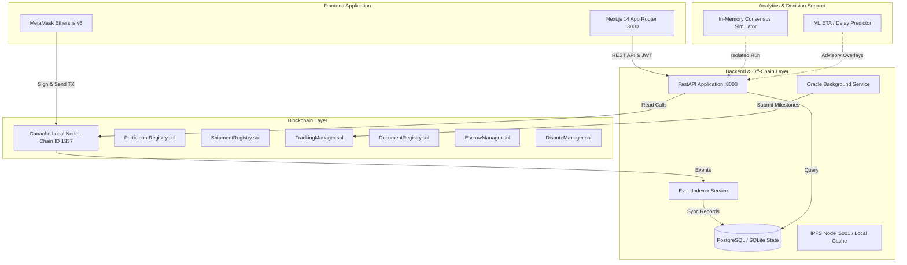

# CargoChain — Phase 7 Repository Audit & Baseline Verification
## Deployment Engineering, Integration & Operational Readiness Assessment

**Project:** CargoChain — Smart Contract-Based Logistics and Freight Management  
**Phase:** Phase 7 (Stage 0 Audit)  
**Author:** Principal Blockchain Architect, Senior DevOps Engineer, QA Lead  
**Date:** October 2026  
**Status:** AUDIT COMPLETE (Ready for Plan Approval)  

---

## 1. Executive Summary

This repository audit establishes the actual, independently verified baseline of **CargoChain** prior to initiating any Phase 7 engineering. The audit inspects all smart contracts, backend APIs, off-chain event indexers, frontend Next.js applications, consensus simulators, machine learning modules, and documentation.

All historical reported results from Phases 0–6 were independently re-executed in the current environment. **All 221 automated tests pass cleanly with zero failures and zero skipped tests**, the Next.js production build generates all 14 routes without errors, and the canonical documentation suite passes all structural and link integrity checks.

---

## 2. Verified Implementation Baseline

### 2.1 Test Suite Execution Verification

| Test Suite | Framework | Command Executed | Tests Passed | Failed | Skipped | Status |
|---|---|---|---|---|---|---|
| **Smart Contracts** | Hardhat / Mocha / Chai | `node ./node_modules/hardhat/internal/cli/cli.js test` | **118** | 0 | 0 | **PASS** |
| **Backend & Indexer API** | Pytest / AnyIO | `.venv\Scripts\pytest backend/tests` | **51** | 0 | 0 | **PASS** |
| **Oracle Service** | Pytest | `.venv\Scripts\pytest oracle/tests` | **7** | 0 | 0 | **PASS** |
| **Consensus Simulator** | Pytest | `.venv\Scripts\pytest simulator/tests` | **11** | 0 | 0 | **PASS** |
| **Machine Learning Module** | Pytest | `.venv\Scripts\pytest ml/tests` | **7** | 0 | 0 | **PASS** |
| **Frontend Web3 & Client** | Node / TSX | `npm test` (in `frontend/`) | **27** | 0 | 0 | **PASS** |
| **Total Automated Tests** | — | — | **221** | **0** | **0** | **100% PASS** |
| **Frontend Production Build** | Next.js 14.2.35 | `npm run build` (in `frontend/`) | **14 routes** | 0 | 0 | **PASS** |
| **Documentation Integrity** | Python custom | `python scripts/audit_docs.py` | **20 / 20 docs** | 0 | 0 | **PASS** |

### 2.2 System Component Architecture

---

## 3. Verified Gaps and Deficiencies

Through detailed inspection of the current repository, the following concrete gaps were identified:

### 3.1 Deployment & Configuration Synchronization Gaps
1. **ABI and Address Synchronization Asymmetry:**
   - Contract deployment (`contracts/scripts/deploy.js`) outputs to `deployments/local.json` and `contracts/abi/*.json`.
   - `scripts/sync_abis.py` exports ABIs to `frontend/src/contracts/abis.ts`, but contract addresses in `frontend/src/contracts/deployments.ts` must be manually updated or copy-pasted.
   - A single-command deployment synchronization tool is needed to ensure deterministic zero-drift deployment across backend and frontend.
2. **Alembic Working Directory Sensitivity:**
   - `backend/alembic.ini` defines `script_location = alembic`. Running `alembic` from the root directory fails because it expects `alembic` to be in `./alembic` rather than `backend/alembic`.
   - Using `script_location = %(here)s/alembic` ensures migrations run identically from either the root or `backend/` directory.
3. **Environment Variable Validation:**
   - While `.env.example` exists, there is no automated environment verification script to check whether all local ports (8545, 8000, 3000, 5432, 5001) and dependencies are properly configured before running.

### 3.2 End-to-End Integration Testing Gaps
1. **Multi-Role End-to-End Integration Harness:**
   - Current backend tests test routers independently using simulated database fixtures and mock authorization headers.
   - An end-to-end integration test (`backend/tests/test_e2e_integration.py`) covering the complete multi-party lifecycle (Shipper -> Transporter -> Warehouse -> Oracle -> Receiver -> Admin) in a single unified execution sequence will improve deployment confidence.
2. **Operational Failure Handling Verification:**
   - Additional explicit tests are required to verify failure paths:
     - Disconnected blockchain RPC fallback during API reads.
     - Indexer idempotency upon duplicate event reprocessing or service restart.
     - Request entity too large (payload limit) and unauthorized cross-tenant resource access (IDOR).

### 3.3 Operational Readiness & Diagnostics Gaps
1. **Liveness vs. Readiness Separation:**
   - Current `GET /api/v1/health` combines all status checks into a single endpoint.
   - Industry-standard operational practices require distinct `/health/liveness` (is the process responsive?) and `/health/readiness` (can the service safely accept user traffic, check DB read/write, verify RPC connectivity, and report indexer sync progress without leaking secrets).
2. **Indexer Lag & Diagnostic Metrics:**
   - The health endpoint does not currently report indexer block height vs. current blockchain head height, making silent indexing stalls difficult to detect.

### 3.4 Demonstration & Release Packaging Gaps
1. **Deterministic Demo Seeding Tool:**
   - While documentation provides `DEMO_SCRIPT.md`, there is no automated script to seed reproducible demo data (participants with display names, active shipments with waypoints, disputes, and documents) into a freshly started environment.
   - A deterministic `scripts/seed_demo.py` is needed to enable a seamless 5-minute academic presentation.
2. **Git Version Control & Remote Repository:**
   - The local project directory is currently not initialized as a git repository (`fatal: not a git repository`).
   - The user has requested to initialize and push the repository to `https://github.com/RudranshD24/CargoChain.git`.

---

## 4. Preserved Non-Negotiable Boundaries

The audit confirms that all architectural boundaries remain intact:
- Chain ID: 1337 (Local Ganache only; no public chain deployments).
- Funds: Test ETH only; zero real monetary value.
- IPFS: Content hashes anchored on-chain; plaintext storage is acknowledged as an academic prototype limitation.
- Consensus Simulator: Discrete in-memory simulation only; zero capability to mutate live Ganache consensus.
- ML Predictions: Advisory overlay only; zero autonomous smart contract write triggers.
- Privacy: No real personal or shipment data; synthetic test datasets only.

---

## 5. Audit Conclusion

The CargoChain repository is structurally sound with an unbroken test pass baseline of 221 tests. The verified gaps relate specifically to **deployment synchronization, operational diagnostics, end-to-end integration test coverage, demo data automation, and git release packaging**. These form the approved scope for the Phase 7 implementation plan.
